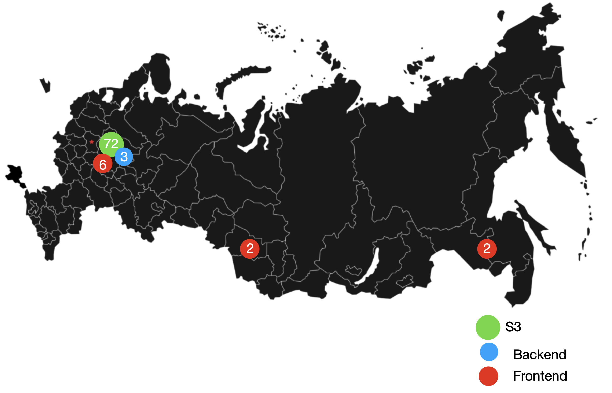

Курсовой проект
=================

Проект представляет собой единую платформу для обучения школьников и студентов. 
Обучение происходит посредством чтения статей, прохождения тестов, 
решения задач и просмотра видеоматериалов.

Содержание
=================
   * [Курсовой проект](#курсовой-проект)
   * [Содержание](#содержание)
   * [Часть 1. Оценка аудитории и нагрузки](#часть-1-оценка-аудитории-и-нагрузки)
      * [Оценка месячной аудитории](#оценка-месячной-аудитории)
      * [Ежедневная аудитория](#ежедневная-аудитория)
      * [Планируемая нагрузка](#планируемая-нагрузка)
      * [Объем хранимого материала](#объем-хранимого-материала)
      * [Моментальная пиковая нагрузка](#моментальная-пиковая-нагрузка)
      * [Используемые материалы:](#используемые-материалы)
   * [Часть 2. Архитектура приложения](#часть-2-архитектура-приложения)
      * [Логическая схема базы данных](#логическая-схема-базы-данных)
         * [Student](#student)
         * [Teacher](#teacher)
         * [Lesson](#lesson)
         * [Test](#test)
         * [Физическая система хранения](#физическая-система-хранения)
         * [Шардирование данных](#шардирование-данных)
         * [Пиковая нагрузка](#пиковая-нагрузка)
      * [Выбор прочих технологий](#выбор-прочих-технологий)
      * [Расчет нагрузки и потребного оборудования](#расчет-нагрузки-и-потребного-оборудования)
         * [Нагрузка на Frontend-сервера](#нагрузка-на-frontend-сервера)
      * [Нагрузка на Backend сервера](#нагрузка-на-backend-сервера)
      * [Нагрузка на S3](#нагрузка-на-s3)
      * [Используемые материалы:](#используемые-материалы-1)
   * [Часть 3. Обеспечение качества](#часть-3-обеспечение-качества)
      * [Расположение серверов](#расположение-серверов)
      * [схема балансировки нагрузки](#схема-балансировки-нагрузки)
      * [обеспечение отказоустойчивости](#обеспечение-отказоустойчивости)
      * [Используемые материалы:](#используемые-материалы-2)

Часть 1. Оценка аудитории и нагрузки
=================

## Оценка месячной аудитории

Основная аудитория проекта – школьники, студенты и преподаватели.

Таблица 1. Целевая аудитория

| Школьники | Студенты | Преподаватели |
| --------- | -------- | ------------- |
| 16.1 млн  | 7.2 млн  | 1.1 млн       |

Таким образом, потенциальная аудитория в России составляет около 
**24 млн. человек** _(16,7% от населения РФ)_.

Наличии государственной поддержки, а также увеличение цифрализации 
учебных заведений во время всеобщей самоизоляции позволят охватить 
значительную часть аудитории.

С учетом уровня проникновения Интернета в 100% среди молодежи, итоговая аудитория
проекта будет составлять те же **24 млн человек**.

## Ежедневная аудитория

Согласно рекомендациям Роспотребнадзора, компьютерная сессия для школьников 
должна составлять от 15 до 30 минут. Исходя из среднего количества уроков в 
день и пятидневной недели, средний школьник будет пользоваться сервисом 
около **70 минут в день**.

Ежедневно все студенты, школьники и преподаватели будут использовать приложение, 
поэтому ежедневная аудитория сопоставима с общей и составляет **24 млн. чел**.

###### В выходные и праздничные дни нагрузка на проект значительно падает.

## Планируемая нагрузка

В течение дня ученик посещает 5 уроков. За это время он просматривает 
5 текстовых материалов, 5 видеоматериалов и проходит 5 тестов.

Предположим, что средний урок содержит в себе около 10 картинок, 500 слов и 10 минут видео материала.
Тогда текстовый материал весит около Кб, 10 картинок – 3Мб, 10 минут full hd видео – 79мб.

###### Обоснование размера приведено в следующей секции

Средняя скорость широкополосного интернета на загрузку по России: 38 Мбит/с. 
Тогда можно считать, что скорости интернета у среднего ученика, использующего
компьютер, достаточно для просмотра full hd видео.

Средняя скорость мобильного интернета на загрузку по России 16 Мбит/c.
Тогда можно считать, что скорости интернета у среднего ученика, использующего
телефон, также достаточно для просмотра full hd видео.

Сделаем допущение, что средний ученик смотрит видео в формате full hd.

Таким образом, хороший ученик потребляет около 450 Мб материала в течение дня, 
а плохой – 3 Мб. Тогда, предположительно, средний ученик будет 
потреблять 50Мб контента.

Общий трафик за день: **1350 ТБ**.

## Объем хранимого материала

Оценим место, которое занимает один урок
###### Числа получины за счет апроксимации размеров материалов на coursera

| Качество  | Занимаемое место (10 мин) |
| :-------- | :-----------------------: |
|   540p    |           17 МБ           |
|   720p    |           45 МБ           |
|   1080p   |           79 МБ           |

Проссуммировав, получаем, что средний урок весит **141 МБ**.

Пусть для простоты лекции для студентов не содержат видео, 
тогда можно предположить, что объем всех образовательных программ 
студентов за год сопоставим с годом школьной прогрммы. 
Обучение студента длится 4 года. Тогда с учетом выходных получаем общий объем
видео-материала:

273\*5\*(11 + 4) \* 0.141 ~ **2.9 ТБ**

###### Заметим, что на небольшой объем данных приходится большая часть трафика

При этом также необходимо хранить информацию о тестах, которые проходят ученики

Пусть часть заданий содержат текстовые эссэ, часть требует отправки картинок, 
часть – простой выбор ответа.

Тогда можно предположить средний объем теста в 300 кб (1 фото на тест).

Ежедневно ученики проходят 5 \* 27 млн тестов ~ **38,5 ТБ** материала 
(Примерно 3.65 Гбит/сек).

Оптимальное решение – хранить результаты теста 2 года, таким образом, 
за два учебных года будет накоплено **21000 ТБ** материала, 
и будет сохранять около постоянный объем.

###### Заметим, что есть большой объем данных, которые редко читаются. При этом их читают как правило в течение небольшого времени с момента загрузки (большинство работ проверяется в течение месяца). 

## Моментальная пиковая нагрузка

Значительная часть населения России живет по Москвоскому времени, 
большая часть школьников учится в дневное время, поэтому можно предположить 
пик нагрузки в период с 8:30 до 13:00 по МСК.

Предположим, что занятия длятся 4,5 часа. 
Относительно Москвы часовые пояса изменяются от -1 до +9.
Учитывая, что занятия начинаются в примерно одно время, и наиболее населенный 
пояс содержит Москву, то 
нас интересует число обучающихся в поясах от -1, 0, +1, +2 и +4. 
Данные пояса охватывают примерно **60%** населения. Пусть также 10% пропустит
занятия.
 
Число активных пользователей при пиковой нагрузке: 

A = 27млн \* 0.6 \* 0.9= **14.6 млн**

Взяв значение для произвольного курса на coursera, получаем примерный битрейт

|   Качество   | Битрейт webm | Битрейт mp4  | Примерная доля |
| :----------- | :----------: | :----------: | :------------: |
|  low (540p)  | 62 Кбит/сек  | 208 Кбит/сек |      10%       |
|  mid (720p)  | 75 Кбит/сек  | 322 Кбит/сек |      20%       |
| high (1080p) |      -       |       -      |      70%       |

Если учесть, что h264 для видео в 1080p на youtube имеет в 1.66 раз больший битрейт, 
то можно предположить, что для coursera этот показатель будет равен `534 Кбит/сек`

Аналогично для webm имеем 75 \* 1.75 = `132 Кбит/сек`

Таким образом,

|   Качество   | Битрейт webm | Битрейт mp4  | Примерная доля |
| :----------- | :----------: | :----------: | :------------: |
|  low (540p)  | 62 Кбит/сек  | 208 Кбит/сек |      10%       |
|  mid (720p)  | 75 Кбит/сек  | 322 Кбит/сек |      20%       |
| high (1080p) | 132 Кбит/сек | 534 Кбит/сек |      70%       |

Формат `webm` не поддерживается в safari, доля пользователей браузера safari 
составляет примерно 10%, для данных пользователей будет использован `mp4`.

Тогда средний битрейт будет примерно равен 

0.9 \* (132 \* 0.7 + 75 \* 0.2 + 62 \* 0.1) + 0.1 \* (534 \* 0.7 + 322 \* 
0.2 + 208 \* 0.1) ~ **150 Кбит/сек**

Учтем, что время начала просмотра видео равномерно распределено в течение часа, 
а также то, что средний ученик смотрит лишь пятую часть видеоурока.

Тогда ширина полосы пропускания при среднем битрейте 150 Кбит/сек

BW = 14.6 млн \* 0.146 Мб/сек / 6 / 5 = **70 Гбит/сек**

## Используемые материалы:

[Образование в цифрах: 2019](https://www.hse.ru/data/2019/08/12/1483728373/oc2019.PDF)

[Аудитория рунета](https://cloud.mail.ru/public/TQZu/3gjz8ELsd)

[Место, которое занимает час видео](https://www.androidauthority.com/how-much-data-does-netflix-use-976146/)

[Средняя скорость интернета](https://www.speedtest.net/reports/ru/russia/#fixed)

[Нормы выполнения работы за компьютером](http://04.rospotrebnadzor.ru/index.php/press-center/healthy-lifestyle/13188-07092020.html)

[Часовым пояса России](http://www.issp.ac.ru/astro/time/2002/020501.html)

[Оценка битрейта](https://toolstud.io/video/filesize.php?dimensions_w=1920&dimensions_h=1080&framerate=24&timeduration=4260&timeduration_unit=seconds)

[Поддержка webm](https://caniuse.com/webm)

[Поддержка mp4](https://caniuse.com/?search=mp4)

[Популярность браузеров](http://alexvaleev.ru/browserstat/)

[Битрейт видео youtube](https://www.tutorialguidacomefare.com/test-video-quality-720p-1080p-1440p-2160p-max-bitrate-which-compresses-youtube/)

[Произвольный курс на coursera](https://www.coursera.org/lecture/algorithms-part2/introduction-to-data-compression-OtmHU)

Часть 2. Архитектура приложения
=================

## Логическая схема базы данных

Наибольший интерес с точки зрения архитектуры представляет сервис тестирования.

Наиболее важные сущности: студент (`Student`), преподаватель (`Teacher`), 
урок (`Lesson`) и сам тест (`Test`).

Опустим вторичные данные на подобие места учебы, информации о классе/группе 
ученика, месте работы учителя, личных данных, и так далее.

### Student

Сущность `Student` хранит информацию о студенте, и идентифицируется по **id**.
Студент способен написать тест и отправить его на проверку учителю.

| Student |
| :------ |
|  **id** |

### Teacher

Сущность `Teacher` хранит информаицю о преподавателе, и идентифицируется по **id**.
Преподаватель способен проверять тесты, написанные учениками.

| Teacher |
| :------ |
|  **id** |

### Lesson

Сущность `Lesson` хранит информацию об уроке, и идентифицируется по **id**.
С `Lesson` связана информация о тестах, пройденных учениками, 
и, проверенных учителями.

|    Lesson     |
| :---------- |
|   **id**    |

### Test

Сущность `Test` хранит информаицю о тесте, и идентифицируется по **id**.
Помимо этого `Test` содержит информацию о студенте и преподавателе,
статус проверки и оценку. В базе данных хранится лишь самая необходимая 
информация о тесте (содержание самого теста находится в другом месте).

|    Test     |
| :---------- |
|   **id**    |
|  student_id |
|  teacher_id |
|  lesson_id  |
|   status    |
|    mark     |
|    name     |
| description |

### Физическая система хранения

Поскольку для данной системы редки конкурентные операции записи, операции 
изменения данных, и данные слабо связаны между собой, то удобно хранить 
информацию о самих сущностях в документоориентированном хранилище или в 
хранилище типа ключ-значение, а информацию о связях между ними хранить в 
реляционной базе данных.

Для хранения информации о студентах, преподавателях и тестах будет использоваться
колоночная база данных в силу большей производительности по сравнению с 
документоориентированными базами, а также отсутствия подходящих решений на основе
хранилищ типа ключ-значение. При необходимости изменения данных, приложение 
будет считывать старую версию данных, вносить изменение и перезаписывать значение.

При этом, поскольку информация о статусе тестов хранятся в реляционной базе данных,
для изменения статуса и проставления оценки не нужно изменять данные в 
колоночном хранилище, а лишь в реляционной базе данных.

**SCYLLA** – хранение тестов, данных учеников и преподавателей 
(слабоструктурированный json).

###### Сами странички с уроками отдаются Frontend сервером, так что нет необходимости хранить их в БД.

Обоснование: первоначально планировалось использовать DynamoDB в силу простоты
горизонтального масштабирования и наличия поддержки ACID. Однако отсутствие 
серверов в России (пинг достигает 130), а также отсутствие возможности развернуть
базу на собственных серверах привело к необходимости поиска аналогов. Выбор пал
на колоночные базы Cassandra и SCYLLA. Поскольку SCYLLA написана на C++, и имеет
большую скорость работы, чем Cassandra. Также обе базы данных имеют открытый 
исходный код. SCYLLA также легко масштабируется в ширину, скрипты на lua 
(но не триггеры), и не поддерживает ACID. Отсутствие ACID некритично, 
поскольку единственное место, где возможны конкурентные действия – изменение 
личных данных пользователя и операции удаления.

**Postgres** – хранение части информации об учениках, преподавателях и тестах, 
а также связей между ними.

Обоснование: Одна из лучших реляционных баз данных.

Подитожим: для просмотра информации о тесте/ученике/преподавателе будет
достаточно обратиться к ScyllaDB. Для изменения статуса теста – только к
Postgres. В случае необходимости создания или удаления записи в любую из таблиц,
начинается транзакция в postgres, вносится значение, затем в ScyllaDB, и 
лишь затем транзакция завершается.

### Шардирование данных

Ежедневно каждый ученик создает несколько тестов, а учитель, как правило, в 
течение пары недель их проверяет. Таким образом, наиболее запрашиваемыми 
являются тесты, созданные в течение пары недель. Тогда имеет смысл создавать 
партиции таблиц с тестами каждые две недели.

Для экономии, данные старше одного месяца можно хранить на старых жестких дисках 
(Задержка не так важна для данных запросов).

Несложно посчитать, что за один месяц накапливается примерно 875 ТБ данных,
которые сложно уместить на одну машину. Если учесть, что люди редко переезжают 
из региона в регион, то удобно использовать шардирование данных тестов по 
географическому признаку.

### Пиковая нагрузка

Основные типы запросов:

- Просмотр списка уроков - 1 SELECT в Postgres
- Просмотр страницы урока - 1 запрос к ScyllaDB

- Просмотр страницы ученика - 1 запрос к ScyllaDB
- Просмотр тестов ученика - 1 SELECT в Postgres
- Просмтр списка тестов к уроку (пройденных учеником) - 1 SELECT в Postgres

- Просмотр страницы преподавателя - 1 запрос к ScyllaDB
- Просмотр тестов преподавателя - 1 запрос к ScyllaDB
- Просмотр списка тестов к уроку (отправленных преподавателю) - 1 SELECT в Postgres

- Отправка теста - 1 INSERT в Postgres и 1 запрос к ScyllaDB
- Проверка теста - 1 UPDATE в Postgres

Как мы раньше посчитали, в течение 4.5 часов ежедневно на сайт заходит около
14.6 млн пользователей. Из них 0.65 млн – преподаватели, оставшиеся 13.8 млн – ученики.
Пусть средний ученик за день проходит 4 теста, просматривает 5 уроков, 
5 раз просматривает список доступных уроков.

Число запросов на одного ученика: 4 + 5 + 5 = 14 за 4.5 часа.

Тогда QPS учеников: 13.8 млн \* 14 / 4.5 / 3600 ~ **12000**

Преподаватель в среднем ежедневно проверяет тесты, присланные его учениками. 
В среднем классе учится 20-30 учеников (возьмем 25), тогда ежедневно преподаватель
проверяет 25 тестов. Также преподаватель просматривает 5 уроков, 
5 раз просматривает список доступных уроков.

Число запросов на одного учителя: 25 + 5 + 5 = 35. за 4.5 часа.

Тогда QPS преподавателей: 0.65 млн \* 35 / 4.5 / 3600 ~ **1400**

Итоговый QPS: 1400 + 12000 ~ **13400**

## Выбор прочих технологий

Видео материалы и материалы лекций будут отдаваться при помощи `nginx`,
балансировка нагрузки и кэширование запросов также будет лежать на nginx.
Для L7 балансировки в nginx имеется 3 алгоритма (round-robin, least-connected, 
ip-hash), а также поддержка весов.

Клиентское приложение (сайт) будет написан на Javascript, в частности с использованием 
технологий Facebook: React, Redux, Relay. С учетом того, что новые уроки
на сайт добавляются относительно редко, большая часть материалов будет
хранится в виде статических файлов благодаря Server Side Rendering.

В качестве языка для серверного приложения выбран Rust. Rust является системным
языком и позволяет писать высокопроизводительные приложения, в Rust удобно 
организована работа с потоками, а также корутинами (async-std). Возможность
работать с соединением на достаточно низком уровне позволяет писать намного 
более производительные приложения. При этом скорость написания кода на Rust
значительно выше, чем на C++ благодаря более информативным ошибкам и хорошему
отладчику.

Для написания микросервисов, на которые не возложена большая нагрузка, будет
использован Java, для части производительных микросервисов – c++ с целью
охвата большей части рынка программистов.

Для коммуникации между микросервисами удобно использовать протокол gRPC. 
Взаимодействие Frontend и Backend серверов происходит посредством https.

Minio – S3 хранилище. Готовое к масштабированию S3 объектное хранилище с 
открытым исходным кодом. 

## Расчет нагрузки и потребного оборудования

### Нагрузка на Frontend-сервера

В обязанности Frontend сервера входит отдача видео и web-страниц.

Материалы лекций являются часто запрашиваемыми, поэтому информация будет
храниться на 4-х терабайтных SSD (RAID 5/6).

Также для повышения производительности будем кэшировать лекции (как правило 
запрашиваются лекции, которые должны быть по учебной программе в этот день).

Возьмем средненький процессор, поскольку данный сервер в основном занимается
отдачей статики, и практически не производит вычислений. Пусть в материнской
плате 4 плашки для оперативной памяти, тогда, используя плашки по 32 ГБ, получаем
128 ГБ оперативной памяти.

Как мы ранее посчитали, в пике объем трафика для данного типа нагрузки 
достигает 70 Гбит/сек при этом фронтенд сервера также проксируют нагрузку на
бекенд, тогда общая нагрузка составляет примерно 73,5 Гбит/сек, при пропускной 
способности сети в 10 Гбит/сек нам потребуется *8 фронтенд серверов*. Для
повышения отказоустойчивость используем 2 резервных сервера.

| Фронтенд сервер |
| :-------------- |
|    4 ТБ ssd     |
|    128 ГБ RAM   |
|   8-ядерный i7  |

## Нагрузка на Backend сервера

Backend-сервер ответственнен за хранение данных о пользователях, тестах и 
активных сессиях.

Объем данных пользователей и тестов невелик (фото хранятся в другом месте, 
так что остается только текстова информация), которые без проблем умещаются на 
одной машине. 

В пике через сервера проходит 3.5 Гбит трафика, 90+% из которого проксируется в
S3 хранилище (основной трафик – тесты с картинками).

Очевидно, что данные учиников и учителей малы по сравнению с тестами (около 100 ГБ).
Если размер одного теста составляет 0.5 КБ (только текстовая часть, 250 слов),
то общий занимаемый объем тестов – 35 ТБ.

Пусть объем трафика, который необходимо обработать Backend-серверу составляет
10% от входящего – 0.36 Гбит/сек. Данный объем без проблем покрывается скоростью
записи одного SSD, тогда можно использовать одинадцать 4-х терабайтных дисков в
RAID 6 (Емкость 36 ТБ, скорость чтения x9, 2 отказа).

Таким образом, нам достаточно одной машины для покрытия нагрузки. Однако для 
повышения отказаустойчивости используем 3 машины (один узел ведущий), расположив
их в трех регионах России.

|   Backend сервер  |
| :---------------: |
|      36ТБ SSD     |
| Средний процессор |
|    Средняя RAM    |

## Нагрузка на S3

Как было ранее подсчитано, на серверах хранится около 21 ПБ материала 
(скорость записи 3.5 Гбит/сек),связанного с тестами. При этом, операции чтения 
достаточно редки, и читаются, как правило данные за последние две недели. 
Поэтому данные целесобразно хранить на HDD.

Используя стенды от WD, в RAID 10 получаем примерно 640 ТБ на стенд, и возможность 
отказа у 1 диска из 65. Таким образом нам понадобится 36 таких стендов.
(Скорость записи возрастает в 32 раза, и покрывает входящий трафик с запасом).

Имеет смысл реплецировать данные на второе хранилище для повышения надежности,
а также для возможности расположить их в двух разных регионах России с целью
уменьшения времени обработки запросов.

|         S3 стенд        |
| :---------------------: |
|        1260 ТБ HDD      |
|     Мощный процессор    |
| Куча оперативной памяти |

## Используемые материалы:

[Kilobytes to Words](http://extraconversion.com/data-storage/kilobytes/kilobytes-to-words.html)

[DynamoDB sharding](https://aws.amazon.com/ru/blogs/database/choosing-the-right-number-of-shards-for-your-large-scale-amazon-dynamodb-table/)

[DynamoDB vs Redis](https://stackoverflow.com/questions/56870326/dynamodb-vs-redis)

[DynamoDB vs MongoDB vs Cassandra](https://db-engines.com/en/system/Amazon+DynamoDB%3BCassandra%3BMongoDB)

[Cassandra vs. MongoDB vs. ScyllaDB](https://db-engines.com/en/system/Cassandra%3BMongoDB%3BScyllaDB)

[DynamoDB alternatives](https://www.quora.com/What-are-open-source-alternatives-to-Amazon-DynamoDB)

[NGINX L7 ](https://nginx.org/en/docs/http/load_balancing.html)

[NGINX Content Caching](https://docs.nginx.com/nginx/admin-guide/content-cache/content-caching/)

[Число учеников в одном классе](https://naviny.media/article/20190905/1567698413-skolko-detey-dolzhno-byt-v-klasse-dvadcat-ili-shestdesyat)

[PostgreSQL and MySQL: Millions of Queries per Second](https://www.percona.com/blog/2017/01/06/millions-queries-per-second-postgresql-and-mysql-peaceful-battle-at-modern-demanding-workloads/)

[Сравнение SKYLLA и Cassandra](https://blog.octo.com/en/scylladb-vs-cassandra-towards-a-new-myth/)

[Сервисы Amazon](https://habr.com/ru/post/348542/)

[Ultrastar Serv60+8 ](https://www.westerndigital.com/products/storage-platforms/ultrastar-serv60-8-hybrid-server)

[Raid6 calculator](http://www.raid-calculator.com/default.aspx)

[20TB HDD](https://www.westerndigital.com/products/data-center-drives/ultrastar-dc-hc600-series-hdd)

[MCS](https://mcs.mail.ru/storage/)

Часть 3. Обеспечение качества
=================

## Расположение серверов

Сервера расположены вблизи сетевых магистралей, а также в местах с высокой
плотностью населения. Значительная часть серверов расположена около Москвы.

В качестве провайдера стоит выбрать Ростелеком или ТТК, поскольку они
имеют наибольшее покрытие в РФ

## Схема балансировки нагрузки

Запросы к Frontend серверу балансируются при помощи Geo-based DNS.

Нагрузка между Backend серверами распределяется при помощи L7 балансировщика.

При проксировании запроса от Backend-сервера к S3 хранилищу выбор делается
на основе расстояния, либо пинга. Каждый из S3 серверов имеют достаточный запас 
производительности, чтобы справиться со всем трафиком, поэтому балансировка
особой нужна для сокращения сетевой задержки.

Остальной внутрипроектный трафик также будет балансироваться при помощи 
L7 балансировщика.

## обеспечение отказоустойчивости

Необходимо свести к минимуму вмешательство человека в систему. На этапе разработки
это достигается за счет автоматизации процесса разработки и тестирования:

1. Использование TDD там, где это возможно

2. Написание большого количества smoke-, unit-, end-to-end-тестов.

3. Регулярные code review

4. Использование Agile/scrum подходов к разработке (Позволяет ускорить процесс разработки).

5. Использование CI и CD.

На этапе промышленной эксплуатации необходимо использовать правильные 
метрики, которые позволят достаточно быстро отреагировать на неисправность
системы. Такими метриками могут быть:

1. Количество пройденных тестов. При неисправность сервиса ученики не могут
отправить тест, либо просмотреть лекции.

2. Количество проверяемых учителями тестов. Если учителя стали проверять меньше
тестов, то существует вероятность, что тесты не доходят до учителей, или
учителя не могут проверить тесты.

3. Средний балл учеников. Если балл падает, то вероятно преподаватели не получают
тесты от учеников. Также есть вероятность, что преподаватели получают задания 
не тех учеников).

4. Среднее время просмотра лекций. В случае падения можно предположить, что
есть проблемы с отдачей видео материалов.

Стоит также тщательно следить за физическим оборудованием, и в случае необходимости
добавлять резервные сервера, либо улучшать существующие.

## Используемые материалы:

[Плотность населения России](http://www.statdata.ru/nasel_regions)

[Магистральные сети](https://www.gea.site/2018/04/638/)

[L4 vs L7](https://www.nginx.com/resources/glossary/layer-4-load-balancing/)